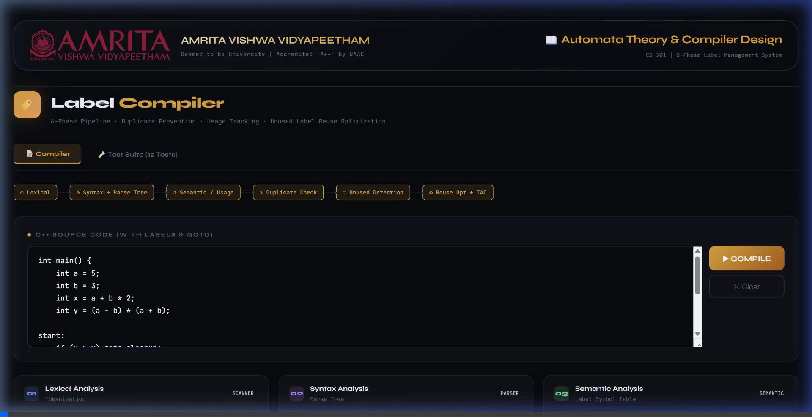
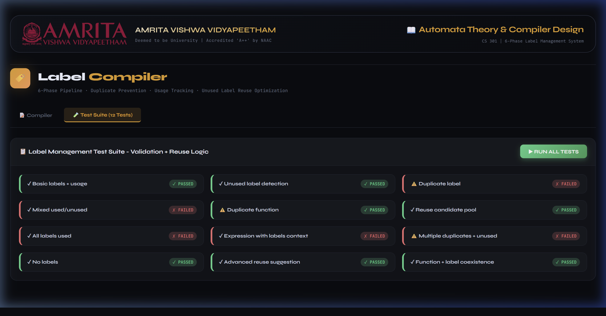

# ATCD - Label Compiler

**Automata Theory & Compiler Design (CS 301) — 6-Phase Label Management System**


*Compiler pipeline dynamically analyzing custom C++ label statements.*

A single-page, premium web-based graphical user interface that implements a complete compiler pipeline for parsing, validating, and optimizing `goto` labels in C++ source code. The project emphasizes advanced parsing logic, structural semantic analysis, dead code elimination (unused label reuse), and modern UI/UX design.


*Built-in Test Suite validating 12 unique state machine management edge cases.*

## 🚀 Features

### 6-Phase Compilation Pipeline
1. **Lexical Analysis (Scanner)**: Custom scanner that tokenizes C++ code to identify keywords, identifiers, literals, operators, strings, and custom `LABEL_DEF` tokens.
2. **Syntax Analysis (Parser)**: Constructs an **Expression Parse Tree** to validate code structure, properly scoping mathematical assignments and conditions.
3. **Semantic Analysis**: Builds a sophisticated **Label Symbol Table** recording definitions and counting definition usages across code blocks to analyze referencing semantics.
4. **Duplicate Detection**: Safely catches instances where single labels or functions are defined multiple times, guarding against structural ambiguity.
5. **Unused Detection**: Performs Dead-Code Analysis, distinguishing actively used labels from orphaned definitions that bloat binary/jump tables.
6. **Reuse Optimization + TAC (Three-Address Code)**: Synthesizes output pointing out which `defined-but-unused` labels can be safely recycled. Recommends "Zero-waste" strategies for optimal jump logic.

## 🎨 Premium GUI
- **Modern Stack**: Built without external dependencies (Vanilla HTML/CSS/JS).
- **Beautiful UI**: JetBrains Mono typography, `Syne` headers, dark glassmorphic styling, and smooth micro-animations.
- **Real-Time Phases**: Dynamic visual representation of the compiler's internal state—with visually parsed AST rendering and symbol table tables.
- **Integrated Test Suite**: A 12-script comprehensive test suite validating correctness across edge cases, duplicated functions, missing labels, and unused definitions.

## 🛠️ Usage

1. Clone this repository:
   ```bash
   git clone https://github.com/Jeevan1725/ATCD-label_compiler.git
   ```
2. Open `index.html` in any modern web browser. No compilation or servers required.
3. Use the **Compiler** tab to input C++ source and run the pipeline (`Code Input -> Run -> AST + Symbol Table output`).
4. Switch to the **Test Suite** tab to execute and validate compiler management rules dynamically.

## 🎓 Context

Developed for Automata Theory & Compiler Design. The system directly implements core theories such as:
- Tokenizer state machines
- AST Generation
- Symbol Table validation
- Optimization techniques (TAC label reuse)
